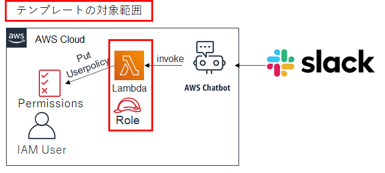

# 時間限定IAMポリシーをIAMユーザーに付与するLambda関数

IAMユーザーに対し、一時的なIAMポリシーを付与するLamba関数を作成するCloudFormationテンプレートです。

## アーキテクチャ

Chatbotを使用したIAMポリシーの付与を想定しています。このテンプレートでは赤枠のLambda関数と関数に付与するIAMロールを作成します。
実際の運用方法は[こちらのブログ](https://fu3ak1.hatenablog.com/)を参考にしてください。



## CloudFormation実行方法（マネジメントコンソール）

「CreateTempIAMPolicy.yml」を、CloudFormationからデプロイするだけです。

ParameterとしてPeriod（単位：分）を設定できます。ここに指定した時間が、Lambda実行時からアクセス可能な期間となります。
デフォルトは180分で、Lambda関数実行後180分間有効なIAMポリシーが付与されます。

## CloudFormation実行方法（AWS CLI）

Parameterの扱いはマネジメントコンソールの場合と同様です。

```sh
aws cloudformation deploy --stack-name createIamPolicy --template-file CreateTempIAMPolicy.yml Period=180 --capabilities CAPABILITY_IAM
```